# ERH Guardian Agent


A values-aligned AI agent built on the **AWS Strands Agents SDK** (Amazon Bedrock) whose
every consequential action is scored by the **Ethical Riemann Hypothesis (ERH) engine**
before it executes — with a human-in-the-loop gate when risk exceeds the user's threshold.

Built for the [Agents for Humans hackathon](https://agentsforhumans.devpost.com/)
(Professional Agents track).

## Why

Agents need *measurable* ethics, not vibes. The ERH engine treats critical misjudgments
as "ethical primes" and checks whether their accumulation stays under a Riemann-style
bound `|E(x)| ≤ C·x^(0.5+ε)`. A fitted growth exponent α ≈ 0.5 means the judgment system
is healthy; α → 1 means systematic failure. ERH Guardian puts that verdict — a 0–100
`risk_score`, a pass/fail `erh_satisfied`, and the exponent α — in front of every
consequential agent action, and pauses for human approval when the risk is too high.

Demo scenario: an IT/security assistant that audits AWS IAM grants for least-privilege
divergence (tagged with MITRE ATT&CK behavioral indicators) and proposes remediations.
Every remediation is ERH-scored and gated.

## Architecture



The GuardianGate decision path in isolation:



(Mermaid sources: [`docs/architecture.mmd`](./docs/architecture.mmd),
[`docs/guardian-gate.mmd`](./docs/guardian-gate.mmd); PNG exports alongside.)

- **Agent**: Strands `Agent` with `BedrockModel` (Claude on Amazon Bedrock).
- **Tools**: thin `@tool` wrappers over the ERH engine's pure `evaluate()` contract.
- **GuardianGate**: a Strands `HookProvider` on `BeforeToolCallEvent` that scores the
  proposed action and uses `cancel_tool` to block it pending human approval.
- **Profile**: a validated value-alignment profile (risk threshold, protected topics,
  auto-approve list) that conditions every gate decision.

## Project layout

- `src/erh_guardian/` — Strands agent: ERH tools, GuardianGate (HITL hook), CLI
- `mcp-worker/` — Cloudflare Worker MCP server: value profiles + decision audit log on D1
  (streamable HTTP `/mcp`, SSE `/sse`, REST `/api/*` for the panel)
- `ui/` — transparency panel (Vite + React): profile, risk bars, ERH verdicts
- `tests/` — offline tests (no Bedrock/AWS calls)

## Setup

Requires Python 3.10+, an AWS account with Bedrock model access (Claude), and AWS
credentials configured (`aws configure` or environment variables).

```bash
# from this repository's root
python -m venv .venv && source .venv/bin/activate
pip install -e '.[dev]'   # pulls the ERH engine pinned in pyproject.toml

# run the interactive guardian (needs Bedrock access)
erh-guardian chat

# run the offline demo scenario (no AWS calls; fixtures only)
erh-guardian demo

# tests
pytest tests -q
```

The ERH engine (disclosed pre-existing code) is installed automatically as the
`erh` dependency, pinned to an exact
[Ethic-Latex](https://github.com/dennislee928/Ethic-Latex) commit in
`pyproject.toml`. `pip install erh` from PyPI is an alternative source. When this
directory lives inside the Ethic-Latex monorepo, the engine is also picked up
directly from the repo root without installation.

Optional environment variables:

- `AWS_REGION` (default `us-west-2`)
- `ERH_GUARDIAN_MODEL` (default `global.anthropic.claude-sonnet-4-6`)
- `ERH_GUARDIAN_PROFILE` — path to a value-alignment profile JSON
- `ERH_GUARDIAN_MCP_URL` — streamable HTTP MCP endpoint of the deployed worker
  (e.g. `https://erh-guardian-mcp.<account>.workers.dev/mcp`); enables profile
  persistence and the decision audit log
- `ERH_GUARDIAN_MCP_TOKEN` — bearer token for the worker's MCP endpoints; must
  match the `MCP_AUTH_TOKEN` secret the worker was deployed with (the worker's
  read-only `/api/*` panel feed stays public and needs no token)

## Pre-existing code disclosure

Per the hackathon rules, this project was newly created during the submission period
and **discloses** its use of the pre-existing open-source ERH engine
([dennislee928/Ethic-Latex](https://github.com/dennislee928/Ethic-Latex), MIT):
`erh_engine` / `erh_core` provide the ethical-scoring mathematics, consumed as the
`erh` dependency pinned to an exact commit in `pyproject.toml`. Everything in this
repository (the Strands agent, tools, HITL gate, CLI, MCP worker, UI) is new.

Engine improvements made *during* the hackathon (the Bedrock provider and the
over-refusal scoring fix) were contributed back upstream in
[Ethic-Latex PR #95](https://github.com/dennislee928/Ethic-Latex/pull/95) (merged),
so the old/new boundary is auditable commit-by-commit.

## License

MIT — see [LICENSE](./LICENSE).
